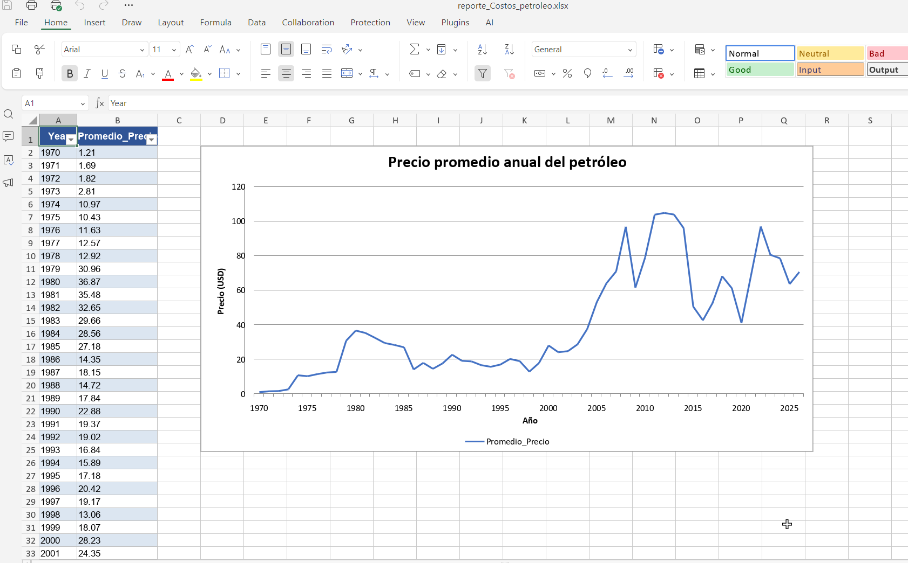
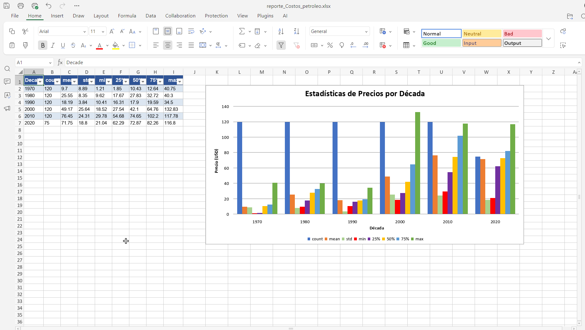
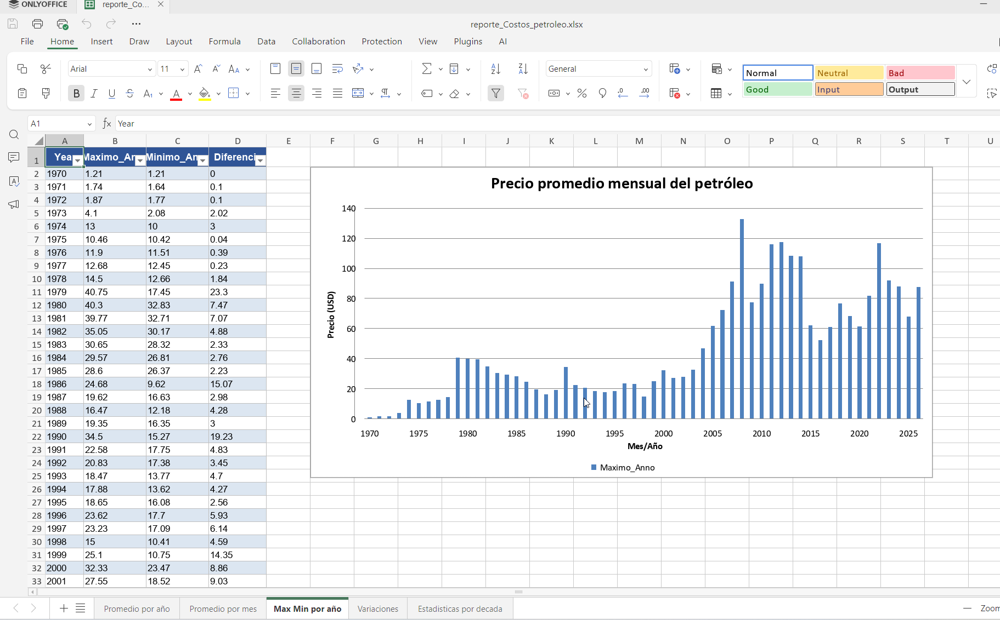
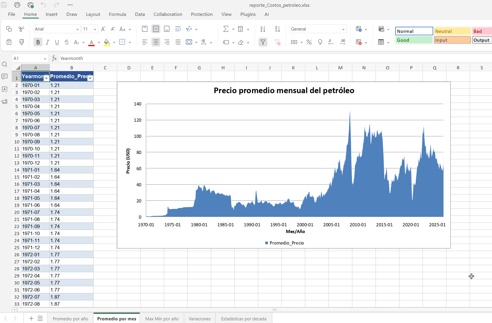
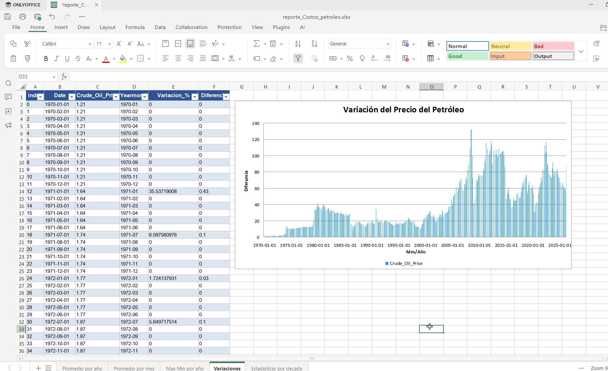

# Estadisticos de Precios del Petroleo (1970-2026)

API REST para consultar estadisticos historicos de precios del petroleo crudo, desde 1970 hasta 2026.

## Indice

- [Descripcion](#descripcion)
- [Tecnologias](#tecnologias)
- [Estructura del Proyecto](#estructura-del-proyecto)
- [Requisitos](#requisitos)
- [Instalacion](#instalacion)
- [Configuracion](#configuracion)
- [Uso](#uso)
- [Endpoints de la API](#endpoints-de-la-api)
- [Tablas de la Base de Datos](#tablas-de-la-base-de-datos)
- [Datos](#datos)

---

## Descripcion

EEste proyecto implementa una solución end-to-end de ingeniería de datos que transforma datos históricos del petróleo en información estructurada y consumible mediante una API REST.

Permite habilitar casos de uso analíticos y de negocio, facilitando la exploración de tendencias, volatilidad y patrones del mercado energético

---
## 🚀 ¿Qué problema resuelve este proyecto?

Este proyecto transforma más de 50 años de datos históricos del petróleo en información estructurada y consumible a través de una API REST, permitiendo:

- Analizar tendencias de mercado energético
- Evaluar volatilidad de precios
- Facilitar la toma de decisiones basada en datos

## 💡 Caso de uso real

- Analistas financieros
- Equipos de BI
- Modelos predictivos de precios

## Tecnologias

| Categoria | Tecnologia | Proposito |
|-----------|------------|-----------|
| **Lenguaje** | Python 3.13 | Lenguaje principal del proyecto |
| **API** | FastAPI | Framework para la API REST |
| **Base de Datos** | PostgreSQL | Almacenamiento de datos |
| **ORM** | SQLAlchemy | Manejo de conexiones a BD |
| **Datos** | Pandas | Procesamiento y analisis de datos |
| **Servidor** | Uvicorn | Servidor ASGI para FastAPI |
| **Validacion** | Pydantic | Configuracion y validacion de settings |
| **Frontend Docs** | Swagger/ReDoc | Documentacion interactiva de la API |

---

## Estructura del Proyecto

```
Segundo_proyecto/
├── api/                      # API REST
│   └── api_estadistico.py    # Endpoints de la aplicacion
├── carga/                    # Carga de datos
│   └── carga_registro.py     # Clase para procesar CSVs
├── config/                   # Configuracion
│   ├── __init__.py
│   └── config.py             # Settings de la aplicacion
├── db/                       # Base de datos
│   ├── base.py               # Configuracion de SQLAlchemy
│   ├── create_tables.py      # Clase para guardar DataFrames
│   └── Cargar_tablas.py      # Script para cargar datos a BD
├── service/                  # Logica de negocio
│   └── estadistico_service.py # Consultas a la base de datos
├── CSV/                      # Datos origen
│   └── fuel_prices_1970_2026.csv
├── Excel/                    # Generacion de reportes
├── powerbi/                  # Reportes de Power BI
└── README.md                 # Este archivo
```

---

## Requisitos

- Python 3.10+
- PostgreSQL
- pip (gestor de paquetes Python)

### Dependencias Python

```
fastapi
uvicorn
sqlalchemy
pandas
psycopg2-binary
pydantic
pydantic-settings
```

---


## 📊 Visualizaciones








## 🔎 Ejemplo de uso

GET /diferencia_anno

Respuesta:
{
  "Year": 2020,
  "Maximo_Anno": 65.23,
  "Minimo_Anno": 20.45,
  "Diferencia": 44.78
}


## 🏗️ Arquitectura

El proyecto sigue una arquitectura modular:

- **Ingesta**: Procesamiento de CSV con Pandas
- **Persistencia**: PostgreSQL
- **Lógica de negocio**: Servicios desacoplados
- **Exposición**: API REST con FastAPI
- **Consumo**: Power BI / Excel

Esto permite escalabilidad, mantenibilidad y reutilización del código.

## 🌍 Demo en vivo

- Swagger UI: http://127.0.0.1:8000/docs
- Endpoint ejemplo: /diferencia_anno

> ⚠️ Próximamente desplegado en la nube

## Instalacion

1. **Clonar o acceder al directorio del proyecto:**

```bash
cd Analisis_de_precios_del_petroleo
```

2. **Crear un entorno virtual (opcional pero recomendado):**

```bash
python -m venv venv
source venv/bin/activate  # Linux/Mac
venv\Scripts\activate     # Windows
```

3. **Instalar las dependencias:**

```bash
pip install fastapi uvicorn sqlalchemy pandas psycopg2-binary pydantic pydantic-settings
```

4. **Configurar la base de datos PostgreSQL:**

```sql
CREATE DATABASE estadisticos_precio_petroleo;
```

---

## Configuracion

Editar el archivo `config/config.py` con las credenciales de tu base de datos:

```python
class Settings(BaseSettings):
    user: str = 'postgres'
    password: str = 'tu_password'
    host: str = 'localhost'
    port: str = '5432'
    database: str = 'estadisticos_precio_petroleo'
```

---

## Uso

### 1. Cargar Datos a la Base de Datos

Ejecutar el script `db/Cargar_tablas.py` para insertar los datos en PostgreSQL:

```bash
cd db
python Cargar_tablas.py
```

Descomentar las lineas de carga de tablas en el archivo segun necesidad.

### 2. Iniciar la API

Desde la raiz del proyecto:

```bash
python api/api_estadistico.py
```

O con uvicorn directamente:

```bash
uvicorn api.api_estadistico:app --reload --host 127.0.0.1 --port 8000
```

### 3. Acceder a la API

- URL base: `http://127.0.0.1:8000`
- Documentacion Swagger: `http://127.0.0.1:8000/docs`
- Documentacion ReDoc: `http://127.0.0.1:8000/redoc`

---

## Endpoints de la API

| Metodo | Endpoint | Descripcion |
|--------|----------|-------------|
| GET | `/diferencia_anno` | Maximo, minimo y diferencia por ano |
| GET | `/media` | Medias moviles (3 y 12 meses) |
| GET | `/promedio_anno` | Promedio de precios por ano |
| GET | `/promedio_mes` | Promedio de precios por mes |
| GET | `/resumen_estadistico` | Estadisticos por decada |
| GET | `/variaciones` | Variacion y diferencia de precios |

---

## Tablas de la Base de Datos

El proyecto crea las siguientes tablas en PostgreSQL:

### `promedios_anno`
Promedio anual de precios del petroleo.

| Columna | Tipo | Descripcion |
|---------|------|-------------|
| index | BIGINT | Indice del registro |
| Year | INTEGER | Ano |
| Promedio_Precio | FLOAT | Precio promedio del ano |

### `promedios_mes`
Promedio mensual de precios del petroleo.

| Columna | Tipo | Descripcion |
|---------|------|-------------|
| index | BIGINT | Indice del registro |
| Yearmonth | TEXT | Ano-Mes (YYYY-MM) |
| Promedio_Precio | FLOAT | Precio promedio del mes |

### `diferencia_anno`
Estadisticos maximos, minimos y diferencia por ano.

| Columna | Tipo | Descripcion |
|---------|------|-------------|
| Year | INTEGER | Ano |
| Maximo_Anno | FLOAT | Precio maximo del ano |
| Minimo_Anno | FLOAT | Precio minimo del ano |
| Diferencia | FLOAT | Diferencia (max-min) |

### `variaciones`
Variacion porcentual y diferencia entre meses.

| Columna | Tipo | Descripcion |
|---------|------|-------------|
| Date | TEXT | Fecha |
| Crude_Oil_Price | FLOAT | Precio del petroleo |
| Yearmonth | TEXT | Ano-Mes |
| Variacion_% | FLOAT | Variacion porcentual |
| Diferencia | FLOAT | Diferencia con mes anterior |

### `media`
Medias moviles de precios.

| Columna | Tipo | Descripcion |
|---------|------|-------------|
| Date | TEXT | Fecha |
| Crude_Oil_Price | FLOAT | Precio del petroleo |
| Media_Movil_12 | FLOAT | Media movil de 12 meses |
| Media_Movil_3 | FLOAT | Media movil de 3 meses |

### `resumen_estadistico`
Estadisticos descriptivos por decada.

| Columna | Tipo | Descripcion |
|---------|------|-------------|
| Decade | INTEGER | Decada (ej: 1970, 1980) |
| count | FLOAT | Cantidad de registros |
| mean | FLOAT | Media |
| std | FLOAT | Desviacion estandar |
| min | FLOAT | Minimo |
| 25% | FLOAT | Percentil 25 |
| 50% | FLOAT | Mediana |
| 75% | FLOAT | Percentil 75 |
| max | FLOAT | Maximo |

---

## Datos

### Fuente
Los datos se encuentran en `CSV/fuel_prices_1970_2026.csv` con el formato:

```csv
Date,Crude_Oil_Price
1970-01-01,1.21
1970-02-01,1.21
...
2026-03-01,87.84
```

### Tipo de Analisis Disponibles

| Tipo | Descripcion |
|------|-------------|
| 1 | Promedio por ano |
| 2 | Promedio por mes |
| 3 | Maximo, minimo y diferencia por ano |
| 4 | Variacion porcentual y diferencia |
| 5 | Medias moviles (3 y 12 meses) |
| 6 | Resumen estadistico por decada |
| 7 | Valores maximo y minimo historicos |

---

## 🤝 Contacto

Estoy abierto a oportunidades, colaboración o feedback sobre este proyecto.

- LinkedIn: https://www.linkedin.com/in/hardostaz/
- Reddit : https://www.reddit.com/user/hardo79_1904/ 

## Licencia

Este proyecto es de uso educativo.

